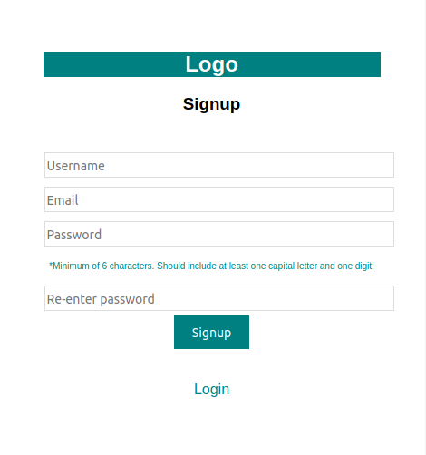
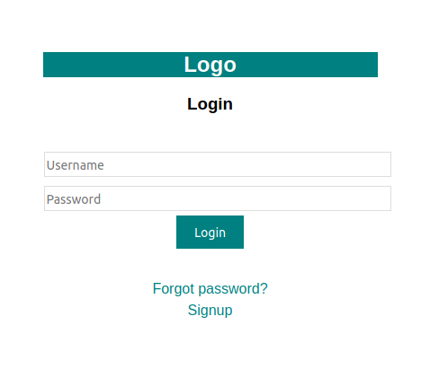
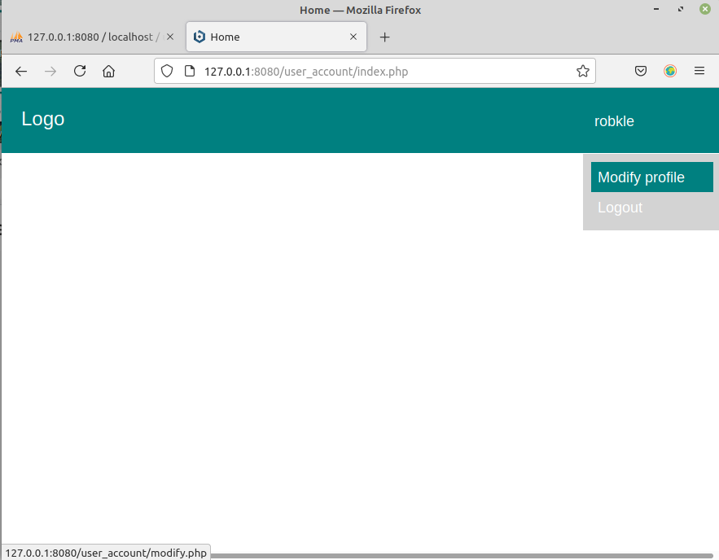
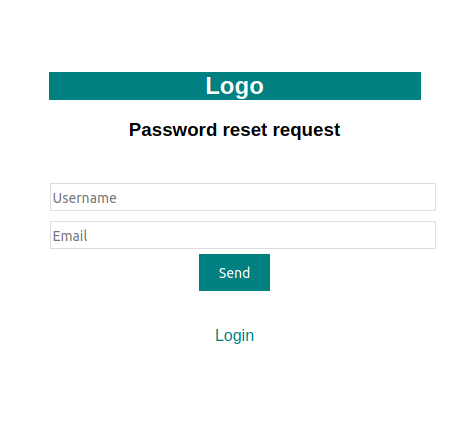
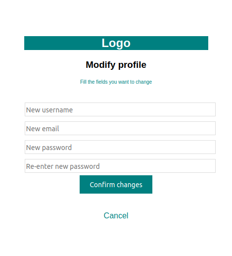

# User_account
User signup and login system with PHP and HTML
## Basic features:  
* Signup with email confirmation
* Validator to check for existing username/email, and for correct email and password format   
* Login  
* Secure password request via email  
* Option to change user information (i.e. username, email or password)  
* Basic CSS styling  

## Missing still:  
* Neat display of error messages in HTML forms  

## Configure:
Configure config/database.php  
```ts
<?php  
  $DB_USER = ''; //<- Insert username for MySQL administrator (e.g. phpMyAdmin)                                                
  $DB_PASSWORD = ''; //<- Insert password                                                 
  $DB_NAME = ''; //<- Insert database name                                   
  $DB_HOST = ''; //<- Insert hostname, e.g. localhost                               
  $DB_DSN = 'mysql:host=' . $DB_HOST . ';dbname=' . $DB_NAME;
```
[Setup PEAR](https://docs.bitnami.com/bch/apps/wordpress/troubleshooting/send-mail/) for email confirmation  
Configure config/email.php  
```ts
<?php  
  $EM_HOST = ''; //<- Insert SMTP address (e.g. 'ssl://smtp.mail.yahoo.com')
  $EM_PORT = ''; //<- Insert SMTP port ('465' for ssl)                                                
  $EM_USER = ''; //<- Insert email account username                         
  $EM_PASSWD = ''; //<- Insert email account password                                  
  ```
  ## Screenshots:  
 
 <details>
  <summary>Screenshots</summary>
  
  
  
  
  
</details>
